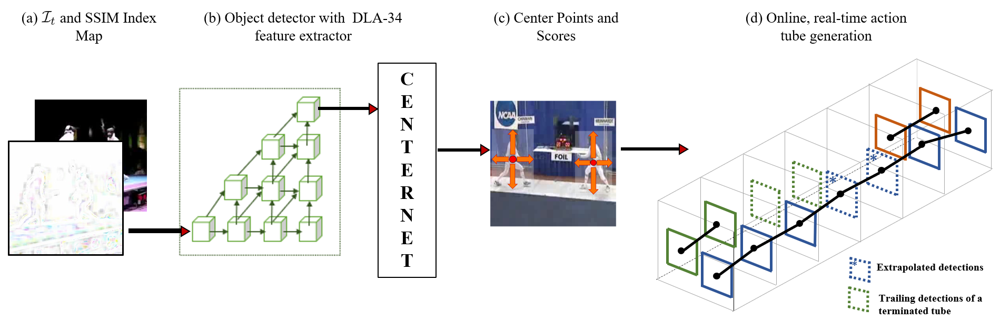

# Key-point Detection based Online Real-Time Spatio-Temporal Action Localization
> Kalana Abeywardena, Sakuna Jayasundara, Sachira Karunasena, Shechem Sumanthiran, Dr. Peshala Jayasekara, Dr. Ranga Rodrigo

<p align='justify'>
Real-time and online action localization in a video is a critical yet highly challenging problem. Accurate action localization requires utilization of both temporal and spatial information. Recent attempts achieve this by using computationally intensive 3D CNN architectures or highly redundant two-stream architectures with optical flow, making them both unsuitable for real-time, online applications. To accomplish activity localization under highly challenging real-time constraints, we propose utilizing fast and efficient key-point based bounding box prediction to spatially localize actions. We then introduce a tube-linking algorithm that maintains the continuity of action tubes temporally in the presence of occlusions. Further, we eliminate the need for a two-stream architecture by combining temporal and spatial information into a cascaded input to a single network, allowing the network to learn from both types of information. Temporal information is efficiently extracted using a structural similarity index map as opposed to computationally intensive optical flow. Despite the simplicity of our approach, our lightweight end-to-end architecture achieves state-of-the-art frame-mAP of 74.7% on the challenging UCF101-24 dataset, demonstrating a performance gain of 6.4% over the previous best online methods. We also achieve state-of-the-art video-mAP results compared to
both online and offline methods. Moreover, our model achieves a frame rate of 41.8 FPS, which is a 10.7% improvement over contemporary real-time methods.
</p>

<p align="center">
  
  <em>Proposed Architecture</em>
</p>

## Table of Content
  1. [Installation](#installation)
  2. [Datasets](#datasets)
  3. [Training CenterNet](#centernet)
  3. [Saving Detections](#detections)
  4. [Online Tube Generation](#tubegeneration)
  5. [Performance](#performance)
  6. [Citation](#citation)
  7. [Reference](#reference)

## Installation

## Datasets
<p align='justify'>
We evaluate our framework on two datasets, <a href=https://www.crcv.ucf.edu/data/UCF101.php>UCF101-24</a> and <a href=http://jhmdb.is.tue.mpg.de/>J-HMDB21</a>. UCF101-24 is a subset of UCF101<sup>[1]</sup> dataset with ST labels, having 3207 untrimmed videos with 24 action classes, that may contain multiple instances for the same action class. J-HMDB-21 is a subset of the HMDB51<sup>[2]</sup> dataset having 928 temporally trimmed videos with 21 actions, each containing a single action instance. 

Download the datasets and extract the frames. Place the extracted frames in <emp>rgb-images</emp> in the respective dataset directory in [Datasets](https://github.com/Kalana304/KORSAL/tree/main/Datasets). The data directory should look as follows:
</p>

<p align="center">
  
  <em>Sample directory tree for J-HMDB21</em>
</p>

## Training CenterNet
### Setting up the CenterNet

### Training from the scratch
To train from the scratch with either ucf101-24 or j-hmdb21 datasets, the following command can be run. 

```
python CUDA_VISIBLE_DEVICES=0 python main_SMDouble.py --dataset <dataset> --gpus <gpu id> --exp_id <save dir name> --task doubleSM --num_epochs <epochs (default: 60)> --variant <variation (default: 1)> 
```

### Resuming from saved checkpoint
To resume the training from the last checkpoint saved, run the following command.

```
python CUDA_VISIBLE_DEVICES=0 python main_SMDouble.py --dataset <dataset> --gpus <gpu id> --exp_id <save dir name> --task doubleSM --num_epochs <epochs (default: 60)> --variant <variation (default: 1)> --resume 
```

Further, to resume the training from a specific chekpoint saved, run the following command.

```
python CUDA_VISIBLE_DEVICES=0 python main_SMDouble.py --dataset <dataset> --gpus <gpu id> --exp_id <save dir name> --task doubleSM --num_epochs <epochs (default: 60)> --variant <variation (default: 1)> --resume --load_model <path to the saved model>
```

### Transfer Learning using the best checkpoint
To tranfer learn from a pre-trained checkpoint, run the following command.

```
python CUDA_VISIBLE_DEVICES=0 python main_SMDouble.py --dataset <dataset> --gpus <gpu id> --exp_id <save dir name> --task doubleSM --num_epochs <epochs (default: 60)> --variant <variation (default: 1)> --load_model <path to the saved model>
```
<p align='justify'>
The pre-trained model checkpoints trained on jhmdb21 and ucf101-24 datasets can be downloaded from <a href=https://drive.google.com/drive/folders/1jb5QfujoQngP4QqyN-PGvYba1jwhb9th?usp=sharing>checkpoints</a>. Place the chekpoints at `exp\dataset-name\dla34\rgb\save-name\` to be compatible with the directory path definitions in the Centernet sripts. </p>

## Saving Detections

## Online Tube Generation

## Performance
<p align='justify'>
We describe our experimental results and compare them with state-of-the-art offline and online methods that use either RGB or both RGB and OF inputs. Further, for comparison
we present results on action localization using only the appearance (A) information extracted by a single frame. The results of our proposed method presented in Table demonstrate that we are able to achieve state-of-the-art performance.
</p >

###### ST action localization results (v-mAP) on UCF101-24 and J-HMDB21 datasets
<table  width="100%">
  <col>
  <colgroup span="5"></colgroup>
  <colgroup span="4"></colgroup>
  <tr>
    <th rowspan="3">Method</th>
    <th colspan="5" scope="colgroup">UCF101-24</th>
    <th colspan="5" scope="colgroup">J-HMDB21</th>
    <th rowspan="3">FPS</th>
  <tr>
    <th rowspan="2">f-mAP <br/> @0.5</th>
    <th colspan="4" scope="colgroup">v-mAP</th>
    <th rowspan="2">f-mAP <br/> @0.5</th>
    <th colspan="4" scope="colgroup">v-mAP</th>
  </tr>
  <tr>
    <th scope="col">0.2</th> <th scope="col">0.5</th> <th scope="col">0.75</th> <th scope="col">0.5:0.95</th>
    <th scope="col">0.2</th> <th scope="col">0.5</th> <th scope="col">0.75</th> <th scope="col">0.5:0.95</th>
  </tr>
  <tr>
    <td scope="row">Saha et al.<sup>[3]</sup></td>
    <td align="center" valign="center">-</td> <td align="center" valign="center">66.6</td> <td align="center" valign="center">36.4</td> <td align="center" valign="center">7.9</td> <td align="center" valign="center">14.4</td>
    <td align="center" valign="center">-</td> <td align="center" valign="center">72.6</td> <td align="center" valign="center">71.5</td> <td align="center" valign="center">43.3</td> <td align="center" valign="center">40.0</td> <td align="center" valign="center">4</td>
  </tr>
  <tr>
    <td scope="row">Peng et al.<sup>[4]</sup></td>
    <td align="center" valign="center">65.7</td> <td align="center" valign="center">72.9</td> <td align="center" valign="center">-</td> <td align="center" valign="center">-</td> <td align="center" valign="center">-</td>
    <td align="center" valign="center">58.5</td> <td align="center" valign="center">74.3</td> <td align="center" valign="center">73.1</td> <td align="center" valign="center">-</td> <td align="center" valign="center">-</td> <td align="center" valign="center">-</td>
  </tr>
  <tr>  
    <td scope="row">Zhang et al.<sup>[5]</sup></td>
    <td align="center" valign="center">67.7</td> <td align="center" valign="center">74.8</td> <td align="center" valign="center">46.6</td> <td align="center" valign="center">16.7</td> <td align="center" valign="center">21.9</td>
    <td align="center" valign="center">37.4</td> <td align="center" valign="center">-</td> <td align="center" valign="center">-</td> <td align="center" valign="center">-</td> <td align="center" valign="center">-</td> <td align="center" valign="center">37.8</td>
  </tr>
  <tr>
    <td scope="row">ROAD+AF<sup>[6]</sup></td>
    <td align="center" valign="center">-</td> <td align="center" valign="center">73.5</td> <td align="center" valign="center">46.3</td> <td align="center" valign="center">15.0</td> <td align="center" valign="center">20.4</td>
    <td align="center" valign="center">-</td> <td align="center" valign="center">70.8</td> <td align="center" valign="center">70.1</td> <td align="center" valign="center">43.7</td> <td align="center" valign="center">39.7</td> <td align="center" valign="center">7</td>
  </tr>
  <tr>
    <td scope="row">ROAD+RTF<sup>[6]</sup></td>
    <td align="center" valign="center">-</td> <td align="center" valign="center">70.2</td> <td align="center" valign="center">43.0</td> <td align="center" valign="center">14.5</td> <td align="center" valign="center">19.2</td>
    <td align="center" valign="center">-</td> <td align="center" valign="center">66.0</td> <td align="center" valign="center">63.9</td> <td align="center" valign="center">35.1</td> <td align="center" valign="center">34.4</td> <td align="center" valign="center">28</td>
  </tr>
  <tr>
    <td scope="row">ROAD (A)<sup>[6]</sup></td>
    <td align="center" valign="center">-</td> <td align="center" valign="center">69.8</td> <td align="center" valign="center">40.9</td> <td align="center" valign="center">15.5</td> <td align="center" valign="center">18.7</td>
    <td align="center" valign="center">-</td> <td align="center" valign="center">60.8</td> <td align="center" valign="center">59.7</td> <td align="center" valign="center">37.5</td> <td align="center" valign="center">33.9</td> <td align="center" valign="center">40</td>
  </tr> 
  <tr>
    <td scope="row"> <strong>Ours (A)</strong> </td>
    <td align="center" valign="center">71.8</td> <td align="center" valign="center">70.2</td> <td align="center" valign="center"><strong>44.3</strong></td> <td align="center" valign="center">16.6</td> <td align="center" valign="center"><strong>20.6</strong></td>
    <td align="center" valign="center"><strong>51.2</strong></td> <td align="center" valign="center">59.3</td> <td align="center" valign="center">59.2</td> <td align="center" valign="center">48.2</td> <td align="center" valign="center"><strong>41.2</strong></td> <td align="center" valign="center"><strong>52.9</strong></td>
  </tr>
  <tr>
    <td scope="row"><strong>Ours</strong> </td>
    <td align="center" valign="center"><strong>74.7</strong></td> <td align="center" valign="center"><strong>72.7</strong></td> <td align="center" valign="center"><strong>43.1</strong></td> <td align="center" valign="center"><strong>16.8</strong></td> <td align="center" valign="center"><strong>20.2</strong></td>
    <td align="center" valign="center">50.5</td> <td align="center" valign="center">58.9</td> <td align="center" valign="center">58.4</td> <td align="center" valign="center"><strong>49.5</strong></td> <td align="center" valign="center">40.6</td> <td align="center" valign="center"><strong>41.8</strong></td>
  </tr>
</table>

<p align='justify'>
We analyze the inference times for different variations of our pipeline based on the different modules in the framework and the overall inference time in the below Table.
Evidently, any preprocessing will have an impact on the inference time. Thus, the SS-map achieves a balance between the run-time and the accuracy over the other variations in the framework.
</p>

###### Inference Run Time Analysis
|  Framework Module  |    Ours   |   A + DSIM |   A + I<sub>t-1</sub> |     A      |     A + RTF    |      A + AF    | 
| :---------------- |:---------:| :---------:| :-----------: | :-----------: | :------------: | :------------: |
|Temporal INFO EXT (ms)|  5.0  | 5.0 |  -  | -  |  7.0  | 110.0 |
|Detection network (ms)| 16.4 | 16.4 | 16.4 | 16.4 | 16.4 | 16.4 |
|Tube generation time (ms)| 2.5 | 2.5 | 2.5 | 2.5 | 3.0 | 3.0 |
|<strong>Overall (ms)</strong>| 23.9 | 23.9 | 18.9 | 18.9 | 26.4 | 129.4 |


## Citation

## Reference
[1] Khurram Soomro, Amir Roshan Zamir, and Mubarak Shah. Ucf101: A dataset of 101 human actions classes from videos in the wild. arXiv preprint arXiv:1212.0402, 2012. \\

[2] H. Jhuang, J. Gall, S. Zuffi, C. Schmid, and M. J. Black. Towards understanding action recognition. In International Conf. on Computer Vision (ICCV), pages 3192–3199,
December 2013.

[3] Suman Saha, Gurkirt Singh, Michael Sapienza, Philip HS Torr, and Fabio Cuzzolin. Deep learning for detecting multiple space-time action tubes in videos. arXiv preprint
arXiv:1608.01529, 2016.

[4] Xiaojiang Peng and Cordelia Schmid. Multi-region two-stream r-cnn for action detection. In ECCV, pages 744–759. Springer, 2016.

[5] Dejun Zhang, Linchao He, Zhigang Tu, Shifu Zhang, Fei Han, and Boxiong Yang. Learning motion representation for real-time spatio-temporal action localization. Pattern
Recognition, 103:107312, 2020.
